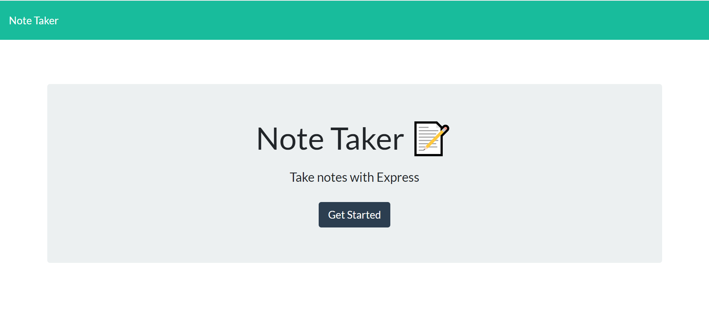
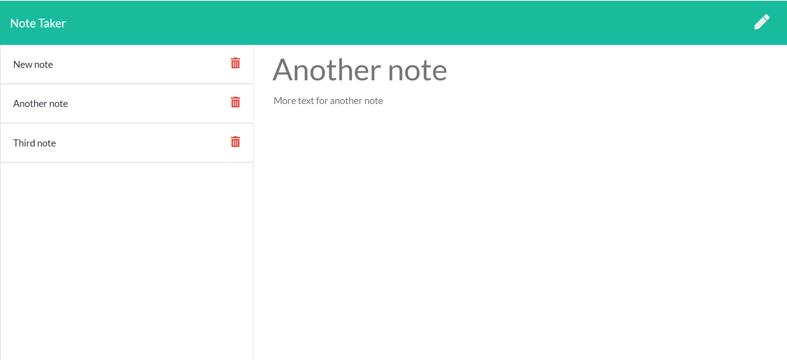

# 11-ExpressNoteTaker

## User Story

```
AS A user, I want to be able to write and save notes
I WANT to be able to delete notes I've written before
SO THAT I can organize my thoughts and keep track of tasks I need to complete
```
## Description

This application is a simple note taking platform.  It allows the user to write notes with a title and text, which are saved and accessible to view again.  It also allows the user to delete notes that are no longer needed. This app includes it own simple server which saves and deletes information without needing to use local storage.

## Completed

```
* Creation of a simple server
* Created api routes to handle user input requests and to apply those changes to the html files
* Created html routes to deliver the completed html pages to the browser upon request
* Used npm packages and express.js to facilitate functionality
```

## Application URL

https://robynp108.github.io/11ExpressNoteTaker/

## Application Screenshot




